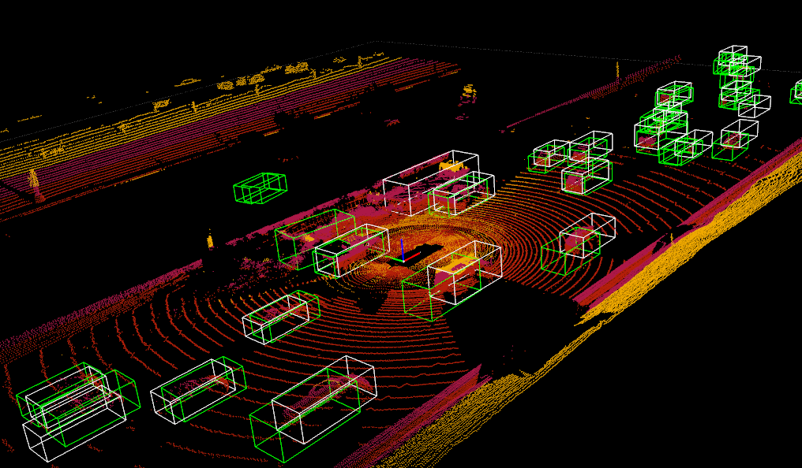

# 3DDepth
## Readthedocs

The document for 3D detection model design and Kitti and Waymo data training: https://mytutorial-lkk.readthedocs.io/en/latest/mydetector3d.html

The document for 3D detection based on V2X cooperative Lidar sensing data: https://mytutorial-lkk.readthedocs.io/en/latest/3DV2X.html

Nuscence dataset and BEV transform based on Lift Splat is available on: https://mytutorial-lkk.readthedocs.io/en/latest/nuscenes.html

## Setup repo
Clone this repository, install this package (need NVIDIA CUDA environment)
```bash
python setup.py develop
```

Install the SparseConv library from [spconv](https://github.com/traveller59/spconv) and [numba](https://numba.pydata.org/numba-doc/latest/user/installing.html):
```bash
pip install spconv-cu117 #pip install spconv-cu118
pip install numba
```

build additional cuda ops libraries via
```bash
(mycondapy39) [010796032@cs001 3DDepth]$ module load cuda-11.8.0-gcc-11.2.0-5tlywx3 #should match pytorch cuda version
(mycondapy39) [010796032@cs001 3DDepth]$ python mydetector3d/ops/setup.py build_ext --inplace
pip install nuscenes-devkit #required by nuscenes dataset
pip install efficientnet_pytorch==0.7.0 #required by lss
pip install pynvml
pip install nvidia-ml-py3 #required by import nvidia_smi
pip3 install --upgrade pyside2 pyqt5 #qt.qpa.plugin: Could not load the Qt platform plugin "xcb"
pip install kornia #required by BEVFusion
$ module load gcc/11.2.0
$ python cudasetup.py build_ext --inplace
```

Install 'mayavi' (ref: https://docs.enthought.com/mayavi/mayavi/installation.html) and open3d (ref: http://www.open3d.org/docs/release/getting_started.html) for 3d point cloud visualization
```bash
conda create --name mycondapy311 python=3.11
conda activate mycondapy311
pip install pyqt6
#test pyqt6: sdrpysim/testpyqt6.py
pip install pyqtgraph
#Successfully installed numpy-1.26.1 pyqtgraph-0.13.3
#import pyqtgraph as pg
#test pyqtgraph: sdrpysim\pyqt6qtgraphtest.py
pip install matplotlib #conda install matplotlib will install pyqt5
#Successfully installed contourpy-1.2.0 cycler-0.12.1 fonttools-4.44.0 kiwisolver-1.4.5 matplotlib-3.8.1 packaging-23.2 pillow-10.1.0 pyparsing-3.1.1 python-dateutil-2.8.2 six-1.16.0
pip install opencv-python-headless
pip install mayavi
#pip3 install PySide6 #will cause pyqt6 not working, but mayavi needs PySide6
pip install pyqt5 #needed by mayavi and matplotlib
conda install -c conda-forge jupyterlab
python VisUtils/testmayavi.py #test mayavi installation
pip install open3d #does not support python3.11, only 3.7-3.10
#install development version of open3d: http://www.open3d.org/docs/latest/getting_started.html
pip install -U --trusted-host www.open3d.org -f http://www.open3d.org/docs/latest/getting_started.html open3d
# Verify installation
python -c "import open3d as o3d; print(o3d.__version__)"
# Open3D CLI
open3d example visualization/draw
python VisUtils/testopen3d.py #test open3d installation
```

## BEV Fusion Training in HPC now
```bash
(mycondapy310) [010796032@cs001 3DDepth]$ python ./mydetector3d/tools/mytrain.py
```

## Kitti Dataset
Check [kittidata](Kitti/kittidata.md) for detailed information of Kitti dataset.

## Waymo Dataset
Check [waymodata](Waymo/waymodata.md) for detailed information of Waymo dataset.

## Second Model Evaluation
```bash
Car AP@0.70, 0.70, 0.70:
bbox AP:9.3604, 9.3554, 9.3554
bev  AP:42.4219, 42.3832, 42.3832
3d   AP:8.9554, 8.1986, 8.1986
aos  AP:3.92, 3.91, 3.91
Car AP_R40@0.70, 0.70, 0.70:
bbox AP:7.8257, 7.8132, 7.8132
bev  AP:40.5975, 40.5732, 40.5732
3d   AP:6.0510, 5.8371, 5.8371
aos  AP:3.31, 3.31, 3.31
Car AP@0.70, 0.50, 0.50:
bbox AP:9.3604, 9.3554, 9.3554
bev  AP:65.6083, 65.5714, 65.5714
3d   AP:30.9710, 30.9507, 30.9507
aos  AP:3.92, 3.91, 3.91
Car AP_R40@0.70, 0.50, 0.50:
bbox AP:7.8257, 7.8132, 7.8132
bev  AP:66.3880, 66.3569, 66.3569
3d   AP:27.7441, 27.7266, 27.7266
aos  AP:3.31, 3.31, 3.31
Pedestrian AP@0.50, 0.50, 0.50:
bbox AP:5.3490, 5.3348, 5.3348
bev  AP:25.8272, 25.8203, 25.8203
3d   AP:7.8393, 7.8479, 7.8479
aos  AP:2.13, 2.12, 2.12
Pedestrian AP_R40@0.50, 0.50, 0.50:
bbox AP:2.8879, 2.8788, 2.8788
bev  AP:20.9853, 20.9857, 20.9857
3d   AP:5.8118, 5.8060, 5.8060
aos  AP:1.05, 1.04, 1.04
Pedestrian AP@0.50, 0.25, 0.25:
bbox AP:5.3490, 5.3348, 5.3348
bev  AP:42.4205, 42.3594, 42.3594
3d   AP:35.0189, 34.9833, 34.9833
aos  AP:2.13, 2.12, 2.12
Pedestrian AP_R40@0.50, 0.25, 0.25:
bbox AP:2.8879, 2.8788, 2.8788
bev  AP:41.3807, 41.3269, 41.3269
3d   AP:30.6733, 30.6291, 30.6291
aos  AP:1.05, 1.04, 1.04
Cyclist AP@0.50, 0.50, 0.50:
bbox AP:0.0413, 0.0411, 0.0411
bev  AP:15.0490, 15.0627, 15.0627
3d   AP:0.4545, 0.4545, 0.4545
aos  AP:0.03, 0.03, 0.03
#Cyclist AP_R40@0.50, 0.50, 0.50:
bbox AP:0.0192, 0.0191, 0.0191
bev  AP:8.6999, 8.6969, 8.6969
3d   AP:0.1583, 0.1582, 0.1582
aos  AP:0.01, 0.01, 0.01
Cyclist AP@0.50, 0.25, 0.25:
bbox AP:0.0413, 0.0411, 0.0411
bev  AP:20.9939, 20.8861, 20.8861
3d   AP:13.2082, 13.2214, 13.2214
aos  AP:0.03, 0.03, 0.03
Cyclist AP_R40@0.50, 0.25, 0.25:
bbox AP:0.0192, 0.0191, 0.0191
bev  AP:16.1843, 16.1113, 16.1113
3d   AP:5.9143, 5.9187, 5.9187
aos  AP:0.01, 0.01, 0.01
```
Average Predicted Points : 50.447


## Visualization of SECOND MODEL



